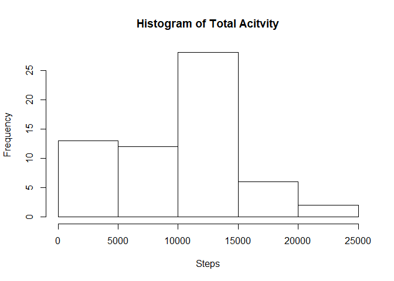
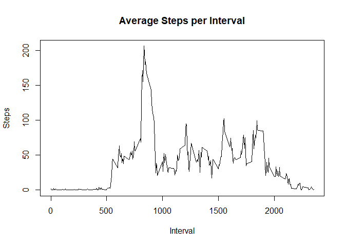
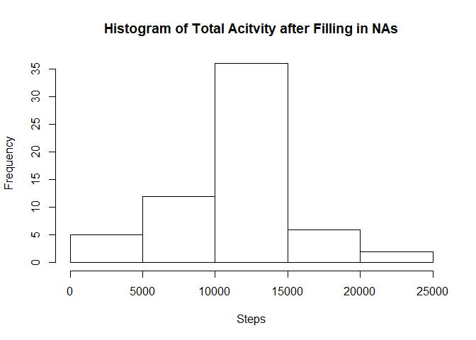
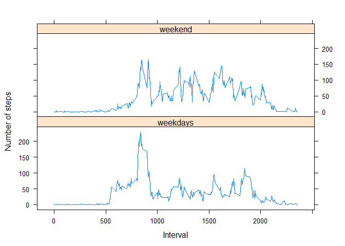

## Loading and preprocessing the data

```r
echo=TRUE 

# Read the activity CSV file including header
df_activity <- read.csv("../activity.csv", header = TRUE)

# Convert date column to Date format
df_activity$date <- as.Date(as.character(df_activity$date), "%Y-%m-%d")
```


## What is mean total number of steps taken per day?

```r
# Calculate daily steps total
tot_steps <- with(df_activity, tapply(steps, date, sum, na.rm=TRUE))

# convert daily total to a data frame
df_tot_steps <- data.frame(date = as.Date(names(tot_steps)), steps = tot_steps)

# Make a histogram of the total number of steps taken each day
hist(df_tot_steps$steps, xlab = "Steps", main = "Histogram of Total Acitvity")
```

<!-- -->

```r
#Calculate and report the mean and median total number of steps taken per day
summary_tot_steps <- summary(tot_steps)
tot_steps_mean <- summary_tot_steps["Mean"]
tot_steps_median <- summary_tot_steps["Median"]
paste("Mean value of total steps:\t", tot_steps_mean["Mean"])
```

```
## [1] "Mean value of total steps:\t 9354.22950819672"
```

```r
paste("Median value of total steps:\t", tot_steps_median["Median"])
```

```
## [1] "Median value of total steps:\t 10395"
```

## What is the average daily activity pattern?


```r
# Calculate average step total per interval
avg_steps <- with(df_activity, tapply(steps, interval, mean, na.rm=TRUE))

# convert interval average to a data frame
df_avg_steps <- data.frame(interval = as.integer(names(avg_steps)), steps = avg_steps)

# Draw a time series chart of the average number of steps taken per interval
plot(df_avg_steps$interval, df_avg_steps$steps, type = "l" , xlab = "Interval", ylab = "Steps", main = "Average Steps per Interval")
```

<!-- -->

```r
# Find out the interval with maximum averge steps
df_avg_steps_max <- df_avg_steps[which.max(df_avg_steps$steps), ]

paste("Interval with maximum average steps: ", df_avg_steps_max$interval)
```

```
## [1] "Interval with maximum average steps:  835"
```
## Imputing missing values


```r
library(dplyr)
```

```
## 
## Attaching package: 'dplyr'
```

```
## The following objects are masked from 'package:stats':
## 
##     filter, lag
```

```
## The following objects are masked from 'package:base':
## 
##     intersect, setdiff, setequal, union
```

```r
# 1. Calculate the number of rows with NA steps
na_total <- nrow(df_activity[is.na(df_activity$steps), ])
print(paste("Total number of rows with NAs:", na_total))
```

```
## [1] "Total number of rows with NAs: 2304"
```

```r
# 2. Fill in missing values with mean of the interval
df_activity_merge <- merge(df_activity, df_avg_steps, by.x = "interval", by.y = "interval")

# 3. Create a new dataset with the missing data filled in
df_activity_rep <- df_activity_merge %>%
   mutate(steps_rep  = ifelse(is.na(steps.x), steps.y, steps.x))

# 4. Make a histogram of the total number of steps taken each day and Calculate and 
#    report the mean and median total number of steps taken per day

# Calculate daily step total
tot_steps_nona <- with(df_activity_rep, tapply(steps_rep, date, sum))

# convert daily total to a data frame
df_tot_steps_nona <- data.frame(date = as.Date(names(tot_steps_nona)), steps = tot_steps_nona)

# Make a histogram of the total number of steps taken each day
hist(df_tot_steps_nona$steps, xlab = "Steps", main = "Histogram of Total Acitvity after Filling in NAs")
```

<!-- -->

```r
#Calculate and report the mean and median total number of steps taken per day
summary_tot_steps_nona <- summary(tot_steps_nona)
tot_steps_mean_nona <- summary_tot_steps_nona["Mean"]
tot_steps_median_nona <- summary_tot_steps_nona["Median"]
paste("Mean value of Steps before and after filling in missing value: \n\tBefore:", tot_steps_mean["Mean"], "\n\tAfter: ", tot_steps_mean_nona["Mean"])
```

```
## [1] "Mean value of Steps before and after filling in missing value: \n\tBefore: 9354.22950819672 \n\tAfter:  10766.1886792453"
```

```r
paste("Median value of Steps before and after filling in missing value: \n\tBefore:", tot_steps_median["Median"], "\n\tAfter: ", tot_steps_median_nona["Median"])
```

```
## [1] "Median value of Steps before and after filling in missing value: \n\tBefore: 10395 \n\tAfter:  10766.1886792453"
```


## Are there differences in activity patterns between weekdays and weekends?

```r
df_activity_rep$week <- ifelse(weekdays(df_activity_rep$date) %in% c("Saturday", "Sunday"), "weekend", "weekdays")

df_activity_rep_mean <- df_activity_rep  %>% 
                        group_by(week, interval) %>%
                        summarize(steps = mean(steps_rep)) 


library("lattice")
with(df_activity_rep_mean, xyplot(steps~interval|week, xlab = "Interval", type = "l", ylab = "Number of steps", layout=c(1,2)))
```

<!-- -->


